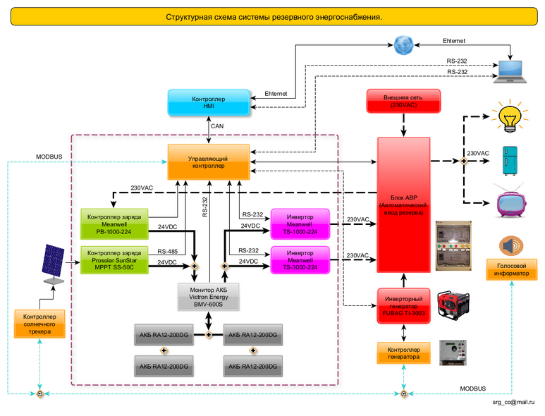
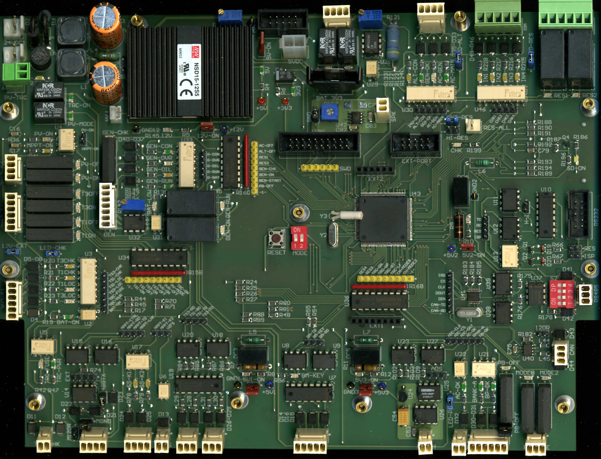

### Управляющий контроллер системы резервного энергоснабжения.
---

Контроллер управления построен на микроконтроллере ARM Cortex-M3 LPC1788 (NXP), 512 kB flash, 96 kB SRAM, используемые интерфейсы: SPI, CAN, UART, MCI.

#### Функции:
* Управление компонентами системы в режимах: ручной, автоматический, смешанный, в т.ч. с помощью встроенного <a href="Doc/scheduler.pdf" target="_blank">планировщика заданий</a>, контроллера [HMI](https://github.com/srgemb/HMI) или консоли управления (RS-232).
* Сбор статистики (параметров) работы компонентов системы с записью на SD карту. 
---

#### Компоненты системы:
* Контроллер [HMI](https://github.com/srgemb/HMI) (human machine interface), интерфейс: CAN.
* Контроллер заряда Prosolar SunStar MPPT SS-50C, интерфейс: RS-485.
* Монитор АКБ Victron energy BMV-600S, интерфейс RS-232.
* Контроллер заряда АКБ от сети переменного тока MeanWell PB-1000-224, интерфейс: «cухой контакт».
* Инверторы MeanWell TS-1000-224, TS-3000-224, интерфейс: RS-232.
* Блок АВР (автоматический ввод резерва), интерфейс: «сухой контакт».
* Генератор инверторный FUBAG TI-3003, интерфейсы: RS-485 (ModBus)/«сухой контакт».
* Контроллер солнечного трекера, интерфейс: RS-485 (ModBus).
* Голосовой информатор (информирование голосовыми сообщениями о состоянии системы), интерфейс: RS-485 (ModBus).

---

#### Дополнительные входы/выходы:

Предусмотрено подключение дополнительных, гальванически изолированных, входов/выходов. 
Восемь выходов с разными токами коммутации:
* Два выхода - DC/AC - 3A, 30/250V, 750VAC/90W.
* Два выхода - DC/AC - 2A, 24/120V, 240VAC/48W.
* Четыре выхода - 150mA/30V.

---

Управление трекером выполняется с помощью солнечного сенсора или по координатам положения солнца (азимут, склонение). Для расчета положения солнца используется алгоритм: [Solar Position Algorithm (SPA)](https://midcdmz.nrel.gov/spa/)

---

#### История изменений.
* **Версия 2.1.0, 10.2021**  
Обмен данными с контроллером HMI переведен на CAN шину.  
* **Версия 2.0.0, 09.2021**  
Управление задачами реализовано средствами RTOS.  
* **Версия 1.2.0, 08.2021**  
Унифицирован функционал и описание параметров компонентов системы.
* **Версия 1.1.0, 06.2020**  
Реализован функционал обмена данными между управляющим контроллером и HMI по интерфейсу SPI.
* **Версия 1.0.0, 07.2019**  
Реализован основной функционал управления и мониторинга.

